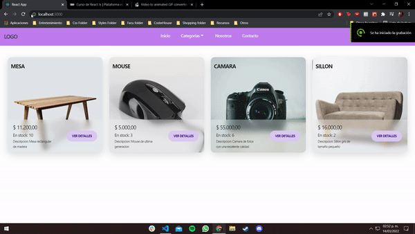

# Ezequiel Vazquez


# Proyecto E-commerce

TecHome consiste en una web donde se pueden realizar compras de articulos para el hogar y tecnologicos.


## Screenshots




## Run Locally

Clone the project

```bash
  git clone https://github.com/EzeVzquez/e-commerce-react
```

Go to the project directory

Install dependencies

```bash
  npm install
```

Start the server

```bash
  npm start
```


## Tech Stack

**Client:** React, Firebase, NextUi, React Router


